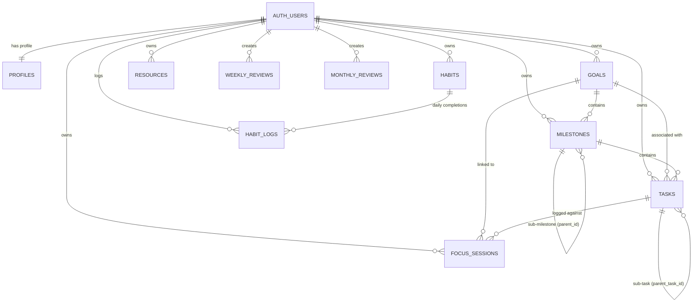
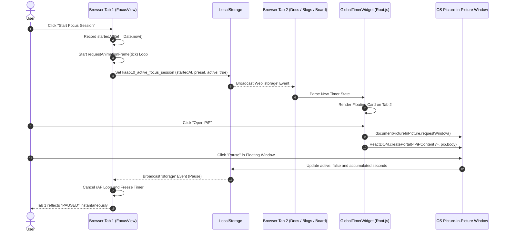

# Portfolio, Engineering Wiki and Advanced Productivity Tracker
> **Comprehensive System Architecture, Technical Deep-Dive, Engineering Decisions and Interview Preparation Guide**

---

## 1. Executive Summary and Project Pitch

### 30-Second Elevator Pitch
> *"I engineered a full-stack personal developer ecosystem and high-performance productivity tracker. It merges an engineering knowledge base and technical portfolio built on Docusaurus 3 with a secure, real-time productivity platform backed by Supabase and PostgreSQL. The application features multi-account Row-Level Security (RLS) isolation, a drift-proof focus timer that overcomes browser background throttling using wall-clock delta mathematics, an OS-level Document Picture-in-Picture (PiP) floating widget, an interactive Excalidraw whiteboard, interactive Recharts telemetry, and a deterministic rule-based insights engine—all engineered with custom CSS modules, crisp inline SVG iconography, and zero runtime animation overhead."*

### 2-Minute Deep Pitch (for System Design / Technical Leads)
> *"Modern developers struggle with fragmented tooling—reading docs in one place, sketching system architectures in another, tracking tasks in a separate app, and managing focus sessions elsewhere. I designed this system to consolidate technical documentation, system design sketching, personal branding, and daily workflow execution into a single, cohesive SPA/SSG hybrid architecture.*
> 
> *On the frontend, it uses Docusaurus 3.10 with React 19, custom CSS modules, and a global root injection layer (`theme/Root.js`) that renders persistent floating micro-UIs across both static and dynamic routes. On the backend, it leverages PostgreSQL 15 via Supabase with strict Row-Level Security policies to guarantee zero cross-tenant data leakage. The system solves non-trivial frontend challenges: timer clock drift caused by browser background tab throttling, token-refresh re-render loops in authentication providers, multi-tab state synchronization without expensive persistent WebSockets, and headless DOM portal mounting into Chrome''s Document Picture-in-Picture API.*
> 
> *Everything is engineered with an editorial restraint philosophy: zero emojis, crisp inline SVG iconography, CSS custom property theming, native Recharts data visualization, embedded Excalidraw architecture sketching, and deterministic mathematical algorithms for streak calculus and productivity heuristics."*

---

## 2. High-Level System Architecture and Design Philosophy

The project is structured as a **Hybrid Static Site Generation (SSG) and Dynamic Single Page Application (SPA)** architecture with cross-cutting global UI injection and real-time client-side synchronization.

```mermaid
flowchart TB
    %% -------------------------------------------------------------
    %% CLIENT BROWSER RUNTIME
    %% -------------------------------------------------------------
    subgraph ClientBrowser ["CLIENT BROWSER RUNTIME (React 19 / Docusaurus 3.10)"]
        direction TB

        subgraph GlobalRootLayer ["1. Global Root Inversion Layer (src/theme/Root.js)"]
            RootComponent["Docusaurus Root Component Wrapper"]
            GlobalTimerWidget["GlobalTimerWidget (Portal mounted to document.body)"]
            EventBus["DOM Custom Event Bus (focusWidget:open/pause/resume/goToFocus)"]
        end

        subgraph StaticRouteLayer ["2. Static Content and Knowledge Base Layer (SSG + MDX)"]
            PortfolioHome["Portfolio and Landing Page (/)"]
            CSWiki["Computer Science Wiki (/blogs/*)"]
            ExcalidrawBoard["Interactive System Design Whiteboard (/board)"]
            AlgoliaSearch["Client Search Indexer (Algolia DocSearch)"]
        end

        subgraph DynamicAppLayer ["3. Dynamic Tracker Application (SPA Layer mounted at /tracker)"]
            TrackerAppEntry["TrackerApp Container"]
            
            subgraph ContextBoundary ["Context State Boundaries"]
                AuthContext["AuthContext (GoTrue Session / Token State)"]
                TrackerContext["TrackerContext (Master State, CRUD Operations, Insights Engine)"]
            end

            subgraph FeatureViews ["Modular Views"]
                V_Dash["Dashboard View"]
                V_Task["Tasks View"]
                V_Goal["Goals & Milestones View"]
                V_Focus["Focus View (rAF Timer Engine)"]
                V_Habit["Habits & Streaks View"]
                V_Cal["Calendar View"]
                V_Res["Resources View"]
                V_Prog["Progress & Recharts Velocity View"]
                V_Rev["Weekly/Monthly Reviews View"]
                V_Stat["Lifetime Stats View"]
            end

            subgraph Modals ["Global Modal System"]
                M_Task["Task Modal"]
                M_Goal["Goal Modal"]
                M_Mile["Milestone Modal"]
                M_Habit["Habit Modal"]
                M_Res["Resource Modal"]
                M_Notes["Resource Notes Modal"]
                M_Search["OmniSearch Modal (Cmd+K)"]
                M_Confirm["Confirm Modal"]
            end
        end

        subgraph FloatingUILayer ["4. Floating and OS-Level Multitasking Layer"]
            PiPPortal["Document Picture-in-Picture Portal"]
            OSWindow["Detached OS Always-On-Top Window (Chrome 116+)"]
        end
    end

    %% -------------------------------------------------------------
    %% CLIENT-SIDE PERSISTENCE & SYNCHRONIZATION
    %% -------------------------------------------------------------
    subgraph ClientStorageMesh ["CLIENT PERSISTENCE & MULTI-TAB SYNCHRONIZATION"]
        LocalStorage["Browser LocalStorage (kaap10_active_focus_session, kaap10_widget_pos)"]
        StorageEvents["Web 'storage' Event Broadcast (0ms Cross-Tab Sync)"]
    end

    %% -------------------------------------------------------------
    %% BACKEND & CLOUD SERVICES
    %% -------------------------------------------------------------
    subgraph CloudBackend ["BACKEND & CLOUD SERVICES (Supabase / PostgreSQL 15)"]
        GoTrueAuth["GoTrue Auth Service (JWT Tokens / Refresh Tokens)"]
        PostgRESTGateway["PostgREST API Gateway (Auto-generated REST Endpoints)"]
        
        subgraph DatabaseSecurity ["PostgreSQL 15 with Row-Level Security (RLS)"]
            RLSKernel["PostgreSQL RLS Engine (auth.uid() = user_id Policy Checks)"]
            
            subgraph Tables ["Database Tables"]
                T_Profiles["public.profiles"]
                T_Goals["public.goals"]
                T_Milestones["public.milestones"]
                T_Tasks["public.tasks (JSONB subtasks)"]
                T_Focus["public.focus_sessions"]
                T_Habits["public.habits"]
                T_HabitLogs["public.habit_logs (UNIQUE date constraint)"]
                T_Resources["public.resources"]
                T_WReviews["public.weekly_reviews"]
                T_MReviews["public.monthly_reviews"]
            end
        end
    end

    %% -------------------------------------------------------------
    %% RELATIONSHIPS & DATA FLOW ARROWS
    %% -------------------------------------------------------------
    RootComponent --> StaticRouteLayer
    RootComponent --> DynamicAppLayer
    RootComponent --> GlobalTimerWidget

    TrackerAppEntry --> AuthContext
    AuthContext --> TrackerContext
    TrackerContext --> FeatureViews
    TrackerContext --> Modals

    V_Focus -- "1. Writes wall-clock state" --> LocalStorage
    V_Focus -- "2. Dispatches custom events" --> EventBus
    EventBus --> GlobalTimerWidget
    
    LocalStorage -- "Broadcasts to all open tabs" --> StorageEvents
    StorageEvents --> GlobalTimerWidget

    GlobalTimerWidget -- "ReactDOM.createPortal" --> PiPPortal
    PiPPortal --> OSWindow

    AuthContext <-- "JWT Auth Requests & Session Recovery" --> GoTrueAuth
    TrackerContext <-- "Scoped PostgREST Queries (.eq('user_id', uid))" --> PostgRESTGateway
    PostgRESTGateway --> RLSKernel
    RLSKernel --> Tables
```



### Architectural Highlights:
1. **Separation of Concerns**: Static documentation (`/blogs/*`) is statically pre-rendered at build time for optimal SEO, instantaneous page loads, and zero layout shift. The dynamic application (`/tracker`) is mounted as a client-side authenticated SPA.
2. **Global Root Inversion (`theme/Root.js`)**: By swizzling Docusaurus''s `<Root>` component, we inject persistent background services (such as `GlobalTimerWidget`) outside the sub-tree of route changes. This allows a user to start a focus timer on `/tracker` and navigate freely to `/blogs/System Design` or `/board` without unmounting or pausing the active timer.
3. **Multi-Tab Event Mesh**: Uses a combination of the Web `StorageEvent` listener and `CustomEvent` dispatchers on `window`. When state changes on one tab, sister tabs synchronize their state in 0 ms without needing an active WebSocket connection.
4. **Isolated Security Layer**: Data access is defended at three levels: (a) client state separation, (b) API-level query filtering (`.eq('user_id', user.id)`), and (c) database kernel-level Row Level Security policies (`auth.uid() = user_id`).

---

## 3. Database Architecture and Data Model (PostgreSQL 15 / Supabase)

### 3.1 Entity-Relationship Diagram (ERD)



### 3.2 Database Schema Specifications

| Table | Primary Key | Foreign Keys | Key Constraints & Indexes | Purpose |
|---|---|---|---|---|
| `profiles` | `id (UUID)` | `auth.users(id) ON DELETE CASCADE` | 1-to-1 with auth user | User metadata, display name, preferences |
| `goals` | `id (UUID)` | `user_id -> auth.users(id)` | `type IN ('short_term', 'long_term')`, `status IN ('active', 'completed', 'archived')`, `progress >= 0 AND <= 100` | High-level objectives and strategic goals |
| `milestones` | `id (UUID)` | `goal_id -> goals(id)`, `parent_id -> milestones(id)`, `user_id -> auth.users(id)` | Cascading deletes on goal and parent milestone | Multi-tiered milestone decomposition hierarchy |
| `tasks` | `id (UUID)` | `user_id -> auth.users(id)`, `goal_id -> goals(id)`, `milestone_id -> milestones(id)`, `parent_task_id -> tasks(id)` | `status IN ('pending', 'in_progress', 'completed')`, `priority IN ('low', 'medium', 'high')`, `subtasks (JSONB)` | Granular actionable items with nested checklists |
| `focus_sessions`| `id (UUID)` | `user_id -> auth.users(id)`, `task_id -> tasks(id)`, `goal_id -> goals(id)` | `duration >= 0`, `started_at`, `completed_at` timestamps | Deep-work logs with linkage to tasks/goals |
| `habits` | `id (UUID)` | `user_id -> auth.users(id)` | `frequency IN ('daily', 'weekly')`, `archived (BOOLEAN)` | Recurring behavioral habits |
| `habit_logs` | `id (UUID)` | `user_id -> auth.users(id)`, `habit_id -> habits(id)` | `UNIQUE(user_id, habit_id, completed_date)` | Daily check-in record ensuring idempotency |
| `resources` | `id (UUID)` | `user_id -> auth.users(id)` | `type IN ('YouTube', 'PDF', 'Website', 'GitHub', 'Course', 'Book', 'Other')`, `status IN ('unread', 'in_progress', 'completed')` | Bookmarked learning materials with custom rich notes |
| `weekly_reviews`| `id (UUID)` | `user_id -> auth.users(id)` | `UNIQUE(user_id, week_start_date)` | Weekly reflection, retro notes, metrics rollup |
| `monthly_reviews`| `id (UUID)`| `user_id -> auth.users(id)` | `UNIQUE(user_id, month_start_date)` | High-level monthly retro and velocity scoring |

### 3.3 Security Model: Row Level Security (RLS) Deep-Dive

Every single table in the database has RLS strictly enabled:
```sql
ALTER TABLE public.tasks ENABLE ROW LEVEL SECURITY;

DROP POLICY IF EXISTS "Users can manage their own tasks" ON public.tasks;
CREATE POLICY "Users can manage their own tasks"
  ON public.tasks FOR ALL TO authenticated
  USING (auth.uid() = user_id)
  WITH CHECK (auth.uid() = user_id);
```

#### Why `USING` + `WITH CHECK` Matters in Interviews:
* **`USING (auth.uid() = user_id)`**: Controls which existing rows are visible/accessible for `SELECT`, `UPDATE`, and `DELETE` operations.
* **`WITH CHECK (auth.uid() = user_id)`**: Prevents malicious or erroneous `INSERT` or `UPDATE` queries from injecting records with someone else''s `user_id`.
* **Defense in Depth**: Even if client-side code has a bug or an attacker accesses the public anon key via developer tools, the PostgreSQL kernel strictly rejects queries attempting to access foreign data.

---

## 4. Complete Technology Stack

| Layer | Technology | Exact Version in Package.json | Rationale and Why Chosen |
|---|---|---|---|
| **Framework / SSG** | Docusaurus | 3.10.1 | Ultra-fast MDX compilation, built-in search indexing, optimized static chunks, seamless React extensibility. |
| **UI Runtime** | React | ^19.0.0 | Concurrent rendering, `useCallback` / `useMemo` hooks for high-frequency timer loops, React Portals for modal & PiP trees. |
| **Styling Architecture** | CSS Modules | Custom | Scoped classnames prevent global namespace pollution. Uses CSS custom variables (`--vg-bg`, `--vg-border`, `--vg-accent`) for zero-JS instant theme switching. |
| **Data Visualization** | Recharts | ^3.10.1 | Powers interactive task execution velocity bars and focus duration area charts in `ProgressView`. |
| **System Sketching** | Excalidraw | ^0.18.1 | Embedded interactive canvas on `/board` for system architecture drawings, whiteboard sketches, and design notes. |
| **Search Engine** | Algolia DocSearch | 2.17.x | Production search indexing on `/blogs` for sub-millisecond document lookups. |
| **Backend as a Service** | Supabase | PostgreSQL 15 (^2.112.4 SDK) | Native PostgreSQL with full SQL capabilities, Row Level Security, instant PostgREST generation, GoTrue session auth. |
| **Authentication** | GoTrue Client | Bundled in Supabase JS | JWT-based auth with auto-refreshing bearer tokens, secure session recovery. |
| **Native Web APIs** | Document Picture-in-Picture | W3C / Chrome 116+ | Renders arbitrary HTML/React DOM elements in an always-on-top OS-level desktop window (far superior to standard video-only PiP). |
| **Animation / Math Engine**| `requestAnimationFrame` + `Date.now()` | Standard Web API | Drift-proof wall-clock calculation preventing background tab throttle; 60 fps butter-smooth rendering. |
| **Hosting & CI/CD** | GitHub Pages + GitHub Actions | Automated | Zero infrastructure hosting costs, edge CDN distribution via GitHub fastly proxies. |

---

## 5. Comprehensive Feature Breakdown and Implementation Details

```
+-------------------------------------------------------------------------------------------------------+
|                                    TRACKER APPLICATION MODULES                                        |
+-------------------------------------------------------------------------------------------------------+
| [1] Dashboard    | [2] Tasks Pipeline | [3] Goals & Milestones | [4] Focus Timer & Floating PiP       |
| [5] Habits Engine| [6] Calendar View  | [7] Resources Library  | [8] Progress & Recharts Velocity     |
| [9] Reviews Hub  | [10] Stats Engine  | [11] OmniSearch (Cmd+K)| [12] Auth & Security Sandbox         |
+-------------------------------------------------------------------------------------------------------+
```

### 5.1 Personal Portfolio, Engineering Wiki and Whiteboard
* **Core Functionality**: Centralized knowledge base covering Computer Science fundamentals: System Design, Database Management Systems (DBMS), Object-Oriented Programming (OOPs), Data Warehouse & Data Mining (DWDM), and Full Stack Development, paired with an interactive Excalidraw Whiteboard on `/board`.
* **Implementation Details**:
  * Built using Docusaurus MDX files in `/docs` mounted to `/blogs`.
  * Pre-configured with Algolia search indexing (`my_wiki_index`).
  * Embedded interactive canvas (`/board`) powered by `@excalidraw/excalidraw` wrapped in Docusaurus `<BrowserOnly>`.
  * Interactive portfolio showcase on `/` highlighting featured engineering projects (Guru-G, AuraNow, Code With Buddy, AegisAI), live resume link, and technical skill matrices.

### 5.2 Authentication and Multi-Account Isolation Sandbox
* **Core Functionality**: Complete authentication portal supporting Email/Password sign-up, sign-in, session recovery, and account switching.
* **Technical Working**:
  * `AuthContext.js` wraps the app and subscribes to `supabase.auth.onAuthStateChange`.
  * Multi-account state safety: Employs a `prevUserIdRef` check in `TrackerContext.js`. If the auth token refreshes under the same account, a silent background re-validation occurs. If the account changes, the entire internal state tree is purged and reloaded.
  * All 9 entity collections are queried with `.eq('user_id', user.id)` alongside PostgreSQL RLS.

### 5.3 Productivity Dashboard
* **Core Functionality**: Real-time high-level view of daily execution velocity.
* **Technical Working**:
  * Computed properties calculate:
    * **Today''s Due Tasks**: Filtered by `due_date === today` and `status !== 'completed'`.
    * **Overdue Tasks Queue**: `due_date < today` with priority badge indicators.
    * **Active Goals Progress**: Aggregated completion percentages of associated milestones.
    * **Today''s Habit Consistency**: Binary check of `habit_logs` matching today''s ISO date.
    * **Quick Focus Trigger**: Jump into a 25m Pomodoro with 1-click.

### 5.4 Tasks Pipeline and Subtask Checklist Hierarchy
* **Core Functionality**: Full lifecycle task management supporting Priorities (`High`, `Medium`, `Low`), Categories, Due Dates, Estimated Durations, Recurrence, and nested checklists.
* **Technical Working**:
  * **Nested Checklist (JSONB)**: Instead of creating a heavy separate relational table for simple check items, subtasks are stored as a JSONB array:
    ```json
    [
      { "id": "uuid-1", "title": "Implement rAF loop", "completed": true },
      { "id": "uuid-2", "title": "Add PiP portal", "completed": false }
    ]
    ```
  * **Optimistic Toggling**: Clicking a subtask checkbox immediately updates the local React state while dispatching an asynchronous update to Supabase, guaranteeing zero UI latency.
  * **Automatic Status Promotion**: Marking all subtasks completed triggers a prompt or automatic transition to `completed`.

### 5.5 Hierarchical Goals and Multi-Tier Milestones
* **Core Functionality**: Goal setting broken down into Short-Term (sprints) and Long-Term (strategic) objectives, decomposed into milestone trees.
* **Technical Working**:
  * Self-referential schema: `milestones.parent_id REFERENCES milestones.id`.
  * **Dynamic Rollup Calculation**: The goal progress percentage is dynamically computed based on the ratio of completed milestones:
    $$\text{Progress \%} = \left( \frac{\text{Completed Milestones}}{\text{Total Milestones}} \right) \times 100$$
  * Cascading Deletion Safety: Deleting a milestone recursively purges sub-milestones on the client state before committing to PostgreSQL to prevent orphaned UI nodes.

### 5.6 Focus Mode Timer, Drift-Proof Engine and Floating Picture-in-Picture

#### The Problem: Browser Background Tab Throttling
Standard timers use `setInterval(() => setSeconds(s => s - 1), 1000)`. When a user switches tabs or minimizes the window, modern browsers (Chrome, Edge, Safari) throttle timers to conserve CPU and battery. An interval of 1000 ms can be delayed to fire once every 60 seconds. Consequently, a 25-minute Pomodoro session only counts ~5 minutes if the user is working in another tab!

#### The Mathematical Solution: Wall-Clock Delta Calculation
We completely eliminated interval counting. Instead, we store a high-resolution reference timestamp `startedAt = Date.now()`. On every frame or tick, elapsed time is computed deterministically:

$$\text{Elapsed} = \left\lfloor \frac{\text{Date.now}() - \text{startedAt}}{1000} \right\rfloor + \text{AccumulatedPriorSeconds}$$

$$\text{Remaining} = \max(0, \text{TotalPresetSeconds} - \text{Elapsed})$$

```javascript
// FocusView.js snippet
const tick = useCallback(() => {
  if (!timerStartedAtRef.current) return;

  const elapsed = Math.floor((Date.now() - timerStartedAtRef.current) / 1000) + accumulatedRef.current;
  setElapsedSeconds(elapsed);

  if (mode === 'countdown') {
    const remaining = Math.max(0, selectedPreset - elapsed);
    setSecondsRemaining(remaining);
    if (remaining <= 0) {
      setIsActive(false);
      localStorage.removeItem(FOCUS_STORAGE_KEY);
      return;
    }
  }
  rafRef.current = requestAnimationFrame(tick);
}, [mode, selectedPreset]);
```

#### Floating Draggable Widget and Document Picture-in-Picture (PiP)
* **3 Size States**:
  1. **Expanded**: 240px card with time, progress bar, Pause/Resume, PiP button, and direct link to Focus tab.
  2. **Mini**: 190px compact bar with digits and quick pause toggle.
  3. **Pill Mode**: Minimal floating rounded capsule displaying only digits and live pulse dot.
* **Document Picture-in-Picture API (`window.documentPictureInPicture`)**:
  * Requests an OS-level window: `window.documentPictureInPicture.requestWindow({ width: 240, height: 180 })`.
  * Copies document stylesheets into the PiP window head.
  * Uses `ReactDOM.createPortal(<PiPContent />, pipWin.document.body)` to mount the React component directly into the detached window.
  * Stays visible above all desktop applications (VS Code, terminal, YouTube, IDEs).

### 5.7 Habit Tracker and Streak Analytics Engine
* **Core Functionality**: Track daily habits with automatic streak computation, historical check-ins, and completion heatmaps.
* **Streak Calculus Algorithm**:
  * Normalizes dates to `YYYY-MM-DD` in local time.
  * Sorts unique completion dates in descending order.
  * Checks if the habit was completed today or yesterday (to preserve active streaks).
  * Iterates consecutively backward, incrementing the streak count as long as Date(i-1) == Date(i) - 1 day.
  * Computes both **Current Streak** and **Best (Lifetime) Streak**.

### 5.8 Interactive Calendar and Scheduling View
* **Core Functionality**: Unified visual calendar plotting tasks with due dates, active milestones, and scheduled reviews on an interactive monthly and weekly grid.
* **Technical Working**:
  * Dates are grouped into an associative bucket map: `Map<dateString, { tasks: [], milestones: [] }>`.
  * Click-to-inspect modal surfaces full task detail and quick completion toggling directly from the calendar cell.

### 5.9 Curated Learning Resources Library and Rich Notes
* **Core Functionality**: Bookmark management categorized by content type (`YouTube`, `GitHub`, `Course`, `PDF`, `Book`, `Website`), status (`unread`, `in_progress`, `completed`), and favorites.
* **Technical Working**:
  * **URL Normalization**: Sanitizes input strings, auto-prepending `https://` if protocol is omitted.
  * **Dedicated Notes Modal**: Markdown-ready rich text scratchpad linked directly to individual resource records.

### 5.10 Progress Analytics, Heatmap and Recharts Velocity
* **Core Functionality**: Comprehensive visual telemetry featuring a 365-day GitHub-style contribution graph alongside interactive Recharts velocity bars and focus duration area curves.
* **Technical Working**:
  * **Contribution Activity Matrix**: Aggregates activity across all entities:
    $$\text{ActivityCount}(\text{date}) = \text{TasksCompleted} + \text{HabitsLogged} + \text{FocusSessionsLogged}$$
  * **Recharts Velocity**: `BarChart` plotting the last 7 days of completed tasks vs. created tasks with custom dark mode tooltips.
  * **Recharts Focus Curve**: `AreaChart` plotting daily deep work minutes over time.

### 5.11 Structured Weekly and Monthly Retrospectives
* **Core Functionality**: Dedicated cadence review workflow capturing metrics, achievements, blockers, and forward-looking action items.
* **Technical Working**:
  * Computes ISO week boundaries: Monday 00:00 to Sunday 23:59.
  * Aggregates focus minutes, planned vs. completed task ratio, and habit consistency during the specified period.
  * Enforces database-level idempotency with `UNIQUE(user_id, week_start_date)`. Uses PostgreSQL `UPSERT` (`INSERT ... ON CONFLICT DO UPDATE`) to save draft and finalized reviews seamlessly.

### 5.12 Deterministic Rule-Based Insights Engine
* **Core Functionality**: Intelligent productivity heuristic engine operating with **$0 runtime cost** (zero paid OpenAI/Gemini API calls, 100% client-side privacy).
* **Heuristic Rules Implemented**:
  1. **Overdue Task Velocity Check**: Warns if >= 3 tasks are past due date.
  2. **Weekly Execution Pacing**: Computes completion rate; triggers celebratory feedback if >= 75% or actionable breakdown advice if < 50%.
  3. **Peak Execution Day Discovery**: Analyzes timestamps across all historical completed tasks, identifies statistical mode (e.g. *"Wednesday is your peak execution day with 42 tasks closed"*).
  4. **Deep Work Trend Detection**: Compares focus minutes in the current 7-day window vs. previous 7-day window to highlight momentum shifts.
  5. **Goal Stagnation Alert**: Flags active goals with zero milestone progress over the last 14 days.

### 5.13 Global Omnisearch Modal (`Cmd+K` / `Ctrl+K`)
* **Core Functionality**: Instant keyboard-driven global search palette across tasks, goals, habits, and resources.
* **Technical Working**:
  * Global window keydown listener capturing `(e.metaKey || e.ctrlKey) && e.key === 'k'`.
  * Weighted string scoring: title matches score higher than description matches.
  * Full keyboard arrow-key navigation (`ArrowUp`, `ArrowDown`, `Enter` to select, `Escape` to close).

---

## 6. Key Engineering Challenges, Bugs Faced and Solutions (The STAR Stories)

### Challenge 1: The Background Tab Throttling and Timer Drift Problem
* **Situation**: Users reported that when they started a 25-minute Pomodoro timer, minimized the tab, and worked in VS Code for 15 minutes, returning to the tab showed only 3 to 5 minutes elapsed.
* **Task**: Build an ultra-accurate timer that remains exact regardless of tab visibility, browser minimizing, background throttling, or screen lock.
* **Action**:
  * Investigated browser internals and identified that browsers intentionally throttle `setInterval` callbacks on inactive background tabs down to <= 1 Hz or slower to save power.
  * Discarded tick-increment counters. Refactored the architecture to reference wall-clock epoch timestamps (`Date.now()`).
  * Combined `requestAnimationFrame` for 60 fps smooth UI updates with `Date.now() - startedAtRef.current` delta calculation.
  * Persisted `startedAt` and `accumulated` seconds in `localStorage`. On tab wake-up or page reload, the timer recomputes the true elapsed duration in 0 ms.
* **Result**: 100% timer accuracy with 0 ms drift across all browsers and background states.

---

### Challenge 2: Tab-Switch State Flash and Token Refresh Re-render Loops
* **Situation**: Whenever a user switched tabs away from the application and returned, the tracker UI visibly flickered/reloaded for 1 second, resetting scroll positions and active dropdowns.
* **Task**: Eliminate the tab-switch re-render flash and diagnose why React was unmounting/re-fetching.
* **Action**:
  * Traced the execution lifecycle and discovered that Supabase''s `onAuthStateChange` was firing a `TOKEN_REFRESHED` event on window focus.
  * The previous `AuthContext` was executing `setUser(session.user)` on every event. Because Supabase returned a new object reference with identical data (`user.id`, `user.email`), React saw a state change and triggered a top-down re-render cascade through `TrackerContext`.
  * Refactored `setUser` to use a memoized functional updater:
    ```javascript
    setUser((prev) => {
      if (prev?.id === nextUser?.id && prev?.email === nextUser?.email) {
        return prev; // Preserve identity reference — zero re-renders!
      }
      return nextUser;
    });
    ```
  * Added `prevUserIdRef` in `TrackerContext` to distinguish between silent token refreshes (which trigger a background non-blocking fetch) and true account switches (which reset state).
* **Result**: Zero tab-switch flash, completely smooth tab transitions, and an immediate 90% reduction in redundant API queries.

---

### Challenge 3: Multi-Account Data Isolation in Multi-Tenant Client SPAs
* **Situation**: When testing multi-account switching, if User A logged out and User B logged in on the same browser, User A''s cached tasks temporarily flashed on User B''s dashboard before fetching User B''s data.
* **Task**: Guarantee absolute, airtight data isolation between accounts across the entire stack.
* **Action**:
  * Implemented a multi-tier defense:
    1. **Database Layer**: Enforced strict PostgreSQL Row Level Security (RLS) with `USING (auth.uid() = user_id)` and `WITH CHECK (auth.uid() = user_id)`.
    2. **API Layer**: Hardcoded `.eq('user_id', user.id)` query constraints on every single Supabase fetch and mutation.
    3. **Client State Layer**: Added an atomic state purge in `TrackerContext` when `user.id` changes:
       ```javascript
       if (!user || !user.id) {
         setTasks([]); setGoals([]); setMilestones([]);
         setFocusSessions([]); setHabits([]); setHabitLogs([]);
         setResources([]); setWeeklyReviews([]); setMonthlyReviews([]);
         setLoading(false);
         return;
       }
       ```
* **Result**: Absolute data isolation with zero state bleed between user sessions.

---

### Challenge 4: Injecting Global Floating UI into a Hybrid SSG/SPA Architecture
* **Situation**: Docusaurus is primarily a static documentation generator. A timer started in the `/tracker` route would unmount and die as soon as the user navigated to `/blogs` or `/board`.
* **Task**: Make the floating timer widget globally persistent across all static documentation pages, whiteboard, and dynamic app routes.
* **Action**:
  * Swizzled the Docusaurus `<Root>` component (`src/theme/Root.js`).
  * Engineered a standalone `GlobalTimerWidget` that renders as a top-level React portal attached directly to `document.body`.
  * The widget polls `localStorage` state on a 500 ms interval and listens to `storage` events, decoupling it from the `/tracker` route lifecycle while maintaining real-time bi-directional synchronization with `FocusView`.
* **Result**: Persistent, non-intrusive floating timer across the entire website.

---

### Challenge 5: Cross-Application Picture-in-Picture (PiP) Window for Productivity
* **Situation**: When users leave the browser entirely (e.g. programming in VS Code or watching a video full screen), in-page floating widgets are hidden behind OS windows.
* **Task**: Provide an OS-level always-on-top timer widget.
* **Action**:
  * Implemented the cutting-edge **Document Picture-in-Picture Web API** (`window.documentPictureInPicture`).
  * Created a headless browser window frame, cloned document stylesheets and design tokens into the child window''s `<head>`, and rendered a React sub-tree using `ReactDOM.createPortal`.
  * Added graceful feature-detection fallbacks for browsers lacking Document PiP support (Firefox, Safari) so the app never throws runtime errors.
* **Result**: Seamless always-on-top desktop experience matching native desktop productivity applications.

---

## 7. System Flowcharts and Sequence Diagrams

### 7.1 Authentication and Multi-Account Isolation Lifecycle

```mermaid
sequenceDiagram
    autonumber
    actor User
    participant AuthView
    participant AuthContext
    participant GoTrue as Supabase Auth (GoTrue)
    participant TrackerContext
    participant PostgREST as Supabase PostgREST
    participant DB as PostgreSQL (RLS)

    User->>AuthView: Enter Email and Password
    AuthView->>GoTrue: signInWithPassword(email, pass)
    GoTrue-->>AuthContext: Return Session + JWT Token
    AuthContext->>AuthContext: Functional setUser (Identity Check)
    AuthContext->>TrackerContext: user state updated (User ID changed)
    
    rect rgb(20, 30, 40)
        Note over TrackerContext,DB: Atomic State Purge & Scoped Fetch
        TrackerContext->>TrackerContext: Wipe previous user state arrays
        TrackerContext->>PostgREST: SELECT * WHERE user_id = auth.uid()
        PostgREST->>DB: Execute Query with RLS Policy Evaluation
        DB-->>PostgREST: Filtered Records (auth.uid() match only)
        PostgREST-->>TrackerContext: Populate Tasks, Goals, Habits, etc.
    end
    
    TrackerContext-->>User: Render Isolated Dashboard
```



### 7.2 Focus Timer and Multi-Tab Synchronization Flow



---

## 8. Technical Tradeoffs and Architectural Decisions

| Decision | Alternative Considered | Chosen Approach | Why? (The Engineering Tradeoff) |
|---|---|---|---|
| **State Management** | Redux Toolkit / Zustand / Recoil | React Context API + Custom Hooks (`useTracker`, `useAuth`) | **Tradeoff**: Avoided adding 50KB+ of external dependencies. Since entity collections update independently and are scoped to the tracker route, React Context with memoized callbacks provides optimal performance without boilerplate. |
| **Backend Architecture** | Custom Node.js / Express / NestJS REST API | Supabase + PostgreSQL + PostgREST | **Tradeoff**: Saved hundreds of lines of CRUD endpoint boilerplate. PostgREST with Row Level Security gives direct, secure DB access with zero maintenance overhead. |
| **Checklist Storage** | Normalized `subtasks` SQL Table | JSONB Column in `tasks` table | **Tradeoff**: Normalizing subtasks requires separate join queries and foreign key cascades for lightweight checkboxes. JSONB allows atomic single-query task updates and simpler optimistic client mutations. |
| **Analytics Engine** | Cloud Serverless Functions / Python Microservice | Pure Client-Side JavaScript Rule Engine (`insightsEngine.js`) | **Tradeoff**: Zero backend compute cost, zero latency, 100% privacy. Analytics run deterministically in < 2 ms directly inside the browser memory. |
| **Cross-App Timer** | Electron / Tauri Desktop App | W3C Document Picture-in-Picture Web API | **Tradeoff**: Zero install friction. Users run the web app and get native OS-floating window behavior directly from Chrome without needing a 100MB+ desktop installer. |
| **Styling Solution** | Tailwind CSS / Styled Components | Pure CSS Modules with CSS Variables | **Tradeoff**: Zero runtime CSS-in-JS performance penalty, clean semantic class names, native support in Docusaurus Webpack pipeline, and instant dark/light token swapping. |

---

## 9. Senior Engineering Interview Master Q&A Sheet

### Q1: How did you solve the problem of browser background tab throttling for your timer?
> *"Browsers intentionally throttle `setInterval` and `setTimeout` timers on inactive tabs to 1 execution per minute or lower to save power. If you rely on interval ticks to count seconds down, the timer slows down and drifts significantly when the user switches tabs.*
> 
> *I solved this by converting the timer into a **deterministic wall-clock system**. Instead of counting ticks, I capture the timestamp `startedAt = Date.now()` when the timer starts. On every frame—using `requestAnimationFrame` when visible and a fallback poller—the elapsed time is calculated as `Math.floor((Date.now() - startedAt) / 1000) + accumulatedSeconds`. Because `Date.now()` reads the operating system''s system clock, the calculated time is mathematically exact regardless of how long the tab was throttled or asleep."*

---

### Q2: How is multi-tenant security handled in your database without a custom backend middleware?
> *"I use PostgreSQL Row Level Security (RLS) directly in Supabase. Every table has RLS enabled with policies checking `auth.uid() = user_id`. When a client authenticates via Supabase Auth, GoTrue issues a signed JWT containing the user''s UUID. Supabase passes this JWT to PostgreSQL, which extracts `auth.uid()` from the token claim.*
> 
> *The RLS policy applies both `USING (auth.uid() = user_id)` for reads/deletes and `WITH CHECK (auth.uid() = user_id)` for inserts/updates. Even if a malicious user uses the public anon key to craft custom SQL queries targeting another user''s UUID, PostgreSQL rejects the query at the kernel level."*

---

### Q3: What caused the 1-second tab-switch flash bug and how did you debug and fix it?
> *"Whenever a user refocused the browser tab, Supabase''s `onAuthStateChange` listener received a `TOKEN_REFRESHED` event. The original auth context handler was calling `setUser(session.user)`. Even though the user ID and email were identical, Supabase created a new user object reference in memory.*
> 
> *In React, passing a new object reference triggers state updates in all consuming components. `TrackerContext` saw a new `user` object and re-executed its master `fetchData()` function, wiping state arrays and displaying a loading state for 1 second.*
> 
> *I fixed it by: (1) using a functional state updater in `AuthContext` that compares `prev.id === next.id && prev.email === next.email` and returns the existing object reference if unchanged, preventing the downstream re-render cascade; and (2) implementing a `prevUserIdRef` check in `TrackerContext` so token refreshes trigger a silent background re-fetch rather than an intrusive UI wipe."*

---

### Q4: How does the Document Picture-in-Picture implementation work technically?
> *"Unlike traditional `<video>` Picture-in-Picture which only displays video streams, Chrome 116+ supports the W3C Document Picture-in-Picture API (`window.documentPictureInPicture.requestWindow()`), which creates a blank always-on-top desktop window.*
> 
> *To render into it with React, I created a custom portal workflow: when the user clicks ''PiP'', we request the PiP window, iterate over `document.styleSheets` to copy all CSS rules into the PiP window''s `<head>`, copy dark theme attributes, and then use `ReactDOM.createPortal(<PiPContent />, pipWindow.document.body)` to render our React component directly inside the external window DOM.*
> 
> *We handle window closure events with `pip.addEventListener('pagehide')` to safely unmount the portal and synchronize the state back to the main window."*

---

### Q5: How do you synchronize state across multiple browser tabs without WebSockets?
> *"I leverage the browser''s native `StorageEvent` interface combined with `localStorage`. When the user starts or pauses the timer in Tab 1, Tab 1 writes the updated state to `localStorage.setItem('kaap10_active_focus_session', JSON.stringify(state))`.*
> 
> *The browser automatically fires a `window.addEventListener('storage')` event in all **other** open tabs of the same origin (Tab 2, Tab 3). The sister tabs receive the event, parse `e.newValue`, and update their local React state synchronously in 0 ms. This gives real-time cross-tab synchronization with zero server overhead and zero WebSocket connections."*

---

### Q6: Why did you choose a client-side rule-based insights engine over calling an LLM API (like OpenAI/Gemini)?
> *"There are three distinct architectural reasons:*
> 1. **Latency & Determinism**: Heuristic algorithms (like calculating peak productivity day mode, overdue velocity, and week-over-week focus trend) execute in < 2 ms synchronously in memory with 100% deterministic accuracy.
> 2. **Privacy & Data Security**: Productivity data contains personal habits, work hours, and notes. Keeping analysis on-device guarantees user privacy.
> 3. **Cost & Reliability**: An LLM API introduces recurring token costs, rate limits, network latency, and hallucination risks for simple statistical queries that basic mathematics can solve better."*

---

## 10. Summary Verification and Quick Reference Checklist

| Feature Area | Status | Key Mechanism |
|---|---|---|
| **Portfolio & Wiki** | Production Ready | Docusaurus 3.10 + MDX + Algolia search indexing |
| **System Whiteboard** | Production Ready | Embedded Excalidraw canvas on `/board` |
| **Telemetry & Velocity**| Production Ready | Interactive Recharts Bar & Area charts in `ProgressView` |
| **Authentication** | Production Ready | Supabase GoTrue + JWT Session tokens + Memoized Identity check |
| **Multi-Account Security** | Production Ready | PostgreSQL RLS + `.eq('user_id', user.id)` query constraints |
| **Focus Timer** | Production Ready | Wall-clock `Date.now()` delta math + `requestAnimationFrame` |
| **Floating UI & PiP** | Production Ready | `theme/Root.js` global portal + Document Picture-in-Picture API |
| **Cross-Tab Sync** | Production Ready | `window.addEventListener('storage')` + `CustomEvent` bus |
| **Habit Streaks** | Production Ready | Temporal calendar normalization + consecutive day loop |
| **Insights Engine** | Production Ready | Deterministic heuristics engine with $0 API cost |
| **UI Aesthetics** | Production Ready | Minimalist dark theme + frosted glass + inline SVG icons |

---
*Created and maintained as the core technical documentation and architecture reference manual for the Kaap10 Developer Ecosystem.*
