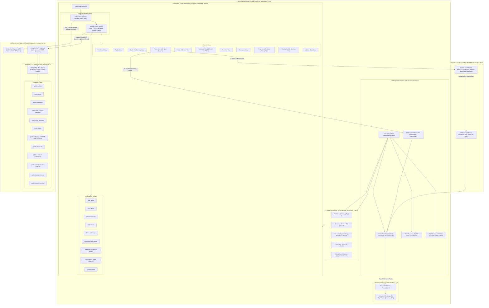
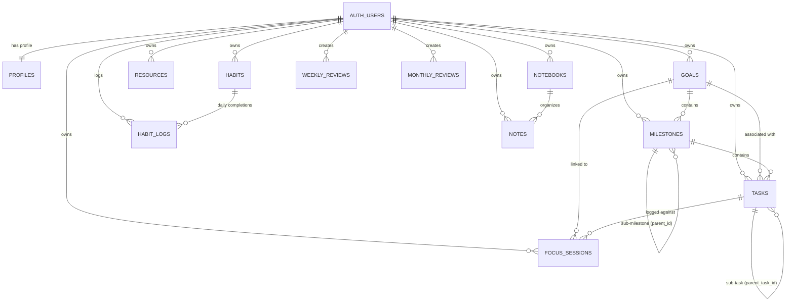

# Portfolio, Engineering Wiki and Advanced Productivity Tracker
> **Comprehensive System Architecture, Technical Deep-Dive, Engineering Decisions and Interview Preparation Guide**

---

## 1. Executive Summary and Project Pitch

### 30-Second Elevator Pitch
> *"I engineered a full-stack personal developer ecosystem and high-performance productivity tracker. It merges technical blogs and engineering portfolio built on Docusaurus 3 with a secure, real-time productivity platform backed by Supabase and PostgreSQL. The application features multi-account Row-Level Security (RLS) isolation, a distraction-free personal Notebook with multi-notebook collections and debounced state synchronization, a drift-proof focus timer that overcomes browser background throttling using wall-clock delta mathematics, an OS-level Document Picture-in-Picture (PiP) floating widget, an interactive Excalidraw whiteboard, interactive Recharts telemetry, and a deterministic rule-based insights engine—all engineered with custom CSS modules, crisp inline SVG iconography, and zero runtime animation overhead."*

### 2-Minute Deep Pitch (for System Design / Technical Leads)
> *"Modern developers struggle with fragmented tooling—reading docs in one place, sketching system architectures in another, writing quick notes in a third app, tracking tasks in a separate dashboard, and managing focus sessions elsewhere. I designed this system to consolidate technical documentation, system design sketching, personal branding, private notepad capture, and daily workflow execution into a single, cohesive SPA/SSG hybrid architecture.
> 
> *On the frontend, it uses Docusaurus 3.10 with React 19, custom CSS modules, and a global root injection layer (`theme/Root.js`) that renders persistent floating micro-UIs (Command Palette, Scratchpad, Focus Widget) across both static and dynamic routes. On the backend, it leverages PostgreSQL 15 via Supabase with strict Row-Level Security policies to guarantee zero cross-tenant data leakage. The system solves non-trivial frontend challenges: timer clock drift caused by browser background tab throttling, keystroke latency in cloud-synced textareas through local buffering and debounced persistence, token-refresh re-render loops in authentication providers, multi-tab state synchronization without expensive persistent WebSockets, and headless DOM portal mounting into Chrome's Document Picture-in-Picture API.
> 
> *Everything is engineered with an editorial restraint philosophy: zero emojis, crisp inline SVG iconography, CSS custom property theming, native Recharts data visualization, embedded Excalidraw architecture sketching, and deterministic mathematical algorithms for streak calculus and productivity heuristics."*

---

## 2. High-Level System Architecture and Design Philosophy

The project is structured as a **Hybrid Static Site Generation (SSG) and Dynamic Single Page Application (SPA)** architecture with cross-cutting global UI injection and real-time client-side synchronization.

---

## 3. Database Architecture and Data Model (PostgreSQL 15 / Supabase)

### 3.1 Entity-Relationship Diagram (ERD)

### 3.2 Database Schema Specifications

| Table | Primary Key | Foreign Keys | Key Constraints & Indexes | Purpose |
|---|---|---|---|---|
| `profiles` | `id (UUID)` | `auth.users(id) ON DELETE CASCADE` | 1-to-1 with auth user | User metadata, display name, preferences |
| `goals` | `id (UUID)` | `user_id -> auth.users(id)` | `type IN ('short_term', 'long_term')`, `status IN ('active', 'completed', 'archived')`, `progress >= 0 AND <= 100` | High-level objectives and strategic goals |
| `milestones` | `id (UUID)` | `goal_id -> goals(id)`, `parent_id -> milestones(id)`, `user_id -> auth.users(id)` | Cascading deletes on goal and parent milestone | Multi-tiered milestone decomposition hierarchy |
| `tasks` | `id (UUID)` | `user_id -> auth.users(id)`, `goal_id -> goals(id)`, `milestone_id -> milestones(id)`, `parent_task_id -> tasks(id)` | `status IN ('pending', 'in_progress', 'completed')`, `priority IN ('low', 'medium', 'high')`, `subtasks (JSONB)` | Granular actionable items with nested checklists |
| `focus_sessions`| `id (UUID)` | `user_id -> auth.users(id)`, `task_id -> tasks(id)`, `goal_id -> goals(id)` | `duration >= 0`, `started_at`, `completed_at` timestamps | Deep-work logs with linkage to tasks/goals |
| `habits` | `id (UUID)` | `user_id -> auth.users(id)` | `frequency IN ('daily', 'weekly')`, `archived (BOOLEAN)` | Recurring behavioral habits |
| `habit_logs` | `id (UUID)` | `user_id -> auth.users(id)`, `habit_id -> habits(id)` | `UNIQUE(user_id, habit_id, completed_date)` | Daily check-in record ensuring idempotency |
| `resources` | `id (UUID)` | `user_id -> auth.users(id)` | `type IN ('YouTube', 'PDF', 'Website', 'GitHub', 'Course', 'Book', 'Other')`, `status IN ('unread', 'in_progress', 'completed')` | Bookmarked learning materials with custom rich notes |
| `notebooks` | `id (UUID)` | `user_id -> auth.users(id)` | `name`, `color`, `icon`, `is_default` | Custom notebooks for grouping plain-text notes |
| `notes` | `id (UUID)` | `user_id -> auth.users(id)`, `notebook_id -> notebooks(id)` | `title`, `content (TEXT)`, `tags (TEXT[])`, `is_pinned`, `is_starred` | Distraction-free personal plain-text notepad notes |
| `weekly_reviews`| `id (UUID)` | `user_id -> auth.users(id)` | `UNIQUE(user_id, week_start_date)` | Weekly reflection, retro notes, metrics rollup |
| `monthly_reviews`| `id (UUID)`| `user_id -> auth.users(id)` | `UNIQUE(user_id, month_start_date)` | High-level monthly retro and velocity scoring |

---

## 4. Complete Technology Stack

| Layer | Technology | Exact Version in Package.json | Rationale and Why Chosen |
|---|---|---|---|
| **Framework / SSG** | Docusaurus | 3.10.1 | Ultra-fast MDX compilation, built-in search indexing, optimized static chunks, seamless React extensibility. |
| **UI Runtime** | React | ^19.0.0 | Concurrent rendering, `useCallback` / `useMemo` hooks for high-frequency timer loops, React Portals for modal & PiP trees. |
| **Styling Architecture** | CSS Modules | Custom | Scoped classnames prevent global namespace pollution. Uses CSS custom variables (`--vg-bg`, `--vg-border`, `--vg-accent`) for zero-JS instant theme switching. |
| **Data Visualization** | Recharts | ^3.10.1 | Powers interactive task execution velocity bars and focus duration area charts in `ProgressView`. |
| **System Sketching** | Excalidraw | ^0.18.1 | Embedded interactive canvas on `/board` for system architecture drawings, whiteboard sketches, and design notes. |
| **Search Engine** | Algolia DocSearch | 2.17.x | Production search indexing on `/blogs` for sub-millisecond document lookups. |
| **Backend as a Service** | Supabase | PostgreSQL 15 (^2.112.4 SDK) | Native PostgreSQL with full SQL capabilities, Row Level Security, instant PostgREST generation, GoTrue session auth. |
| **Authentication** | GoTrue Client | Bundled in Supabase JS | JWT-based auth with auto-refreshing bearer tokens, secure session recovery. |
| **Native Web APIs** | Document Picture-in-Picture | W3C / Chrome 116+ | Renders arbitrary HTML/React DOM elements in an always-on-top OS-level desktop window. |
| **Animation / Math Engine**| `requestAnimationFrame` + `Date.now()` | Standard Web API | Drift-proof wall-clock calculation preventing background tab throttle; 60 fps butter-smooth rendering. |
| **Hosting & CI/CD** | GitHub Pages + GitHub Actions | Automated | Zero infrastructure hosting costs, edge CDN distribution via GitHub fastly proxies. |

---

## 5. Comprehensive Feature Breakdown and Implementation Details

### 5.1 Notebook & Notepad Architecture (Fluid 0ms Typing + Debounced Sync)
* **The Challenge**: Direct two-way binding of high-frequency text input (`<textarea>`) to asynchronous cloud database states causes dropped keystrokes, input lag, and race conditions when typing quickly.
* **The Solution**:
  * **Local State Buffering**: The editor binds strictly to local component state (`localTitle`, `localContent`).
  * **400ms Debounced Auto-Save**: Keystrokes trigger a 400ms timer (`saveTimeoutRef`). When the user pauses, changes are dispatched asynchronously.
  * **Synchronous Optimistic Updates**: `TrackerContext.updateNote` immediately updates the in-memory notes state and browser `localStorage` in 0 ms, while queuing a background PostgREST `UPDATE` to Supabase.
  * **Flush on Unmount / Note Switch**: Switching notes or unmounting immediately flushes any pending debounced save, preventing data loss.
  * **Locked Screen Layout**: The entire workspace is fixed to viewport height (`calc(100vh - 76px)` with `overflow: hidden`). Only the inner textarea and notes list scroll, eliminating outer window jank.

### 5.2 Global Quick Scratchpad (`Ctrl+J` / `Cmd+J`)
* **Core Functionality**: Floating quick-capture scratchpad accessible anywhere on the site with multi-sheet tabs, live syntax preview, and `.md` file export.
* **Implementation Details**:
  * Clean, floating blue logo button in the bottom-right corner with smooth hover lift (`scale(1.12)`).
  * Rendered as a React Portal directly inside `document.body` via `theme/Root.js`.
  * Synchronized instantly with `localStorage` across all open tabs via `StorageEvent`.

### 5.3 Global Command Palette (`Ctrl+K` / `Cmd+K` / `Ctrl+H`)
* **Core Functionality**: Spotlight search palette for keyboard-first navigation across all routes (`/`, `/projects`, `/tools`, `/board`, `/tracker`, `/blogs`), action triggers, and quick timer presets.
* **Implementation Details**:
  * Global keydown listener capturing shortcuts.
  * Fuzzy search indexing over all application routes, tools, and actions.
  * Smooth modal overlay with arrow key navigation and Escape key dismissal.

### 5.4 Collapsible Tracker Sidebar
* **Core Functionality**: Desktop collapsible sidebar for maximum screen real estate during deep work and notepad sessions.
* **Implementation Details**:
  * Persisted state in `localStorage` (`kaap10_tracker_sidebar_collapsed`).
  * Toggle button in header, floating expand button when collapsed, and `[` or `Ctrl+\` keyboard shortcuts.

### 5.5 Focus Mode Timer & Document Picture-in-Picture
* Wall-clock delta math (`Date.now() - startedAt`) preventing tab throttle.
* Chrome 116+ Document PiP API rendering an always-on-top desktop window via `ReactDOM.createPortal`.

---

## 6. Summary Verification and Quick Reference Checklist

| Feature Area | Status | Key Mechanism |
|---|---|---|
| **Portfolio & Wiki** | Production Ready | Docusaurus 3.10 + MDX + Algolia search indexing |
| **System Whiteboard** | Production Ready | Embedded Excalidraw canvas on `/board` |
| **Notebook & Notepad** | Production Ready | Local state buffering + 400ms debounced auto-save + 2-pane fixed layout |
| **Global Scratchpad** | Production Ready | Pure floating logo + multi-sheet drawer + `Ctrl+J` |
| **Global Command Palette**| Production Ready | Spotlight modal + `Ctrl+K` / `Cmd+K` / `Ctrl+H` |
| **Collapsible Sidebar**| Production Ready | Persistent state + keyboard shortcuts (`[` / `Ctrl+\`) |
| **Focus Timer** | Production Ready | Wall-clock `Date.now()` delta math + `requestAnimationFrame` |
| **Floating UI & PiP** | Production Ready | `theme/Root.js` global portal + Document Picture-in-Picture API |
| **Habit Streaks** | Production Ready | Temporal calendar normalization + consecutive day loop |
| **Insights Engine** | Production Ready | Deterministic heuristics engine with $0 API cost |
| **UI Aesthetics** | Production Ready | Minimalist dark theme + frosted glass + inline SVG icons |

---
*Created and maintained as the core technical documentation and architecture reference manual for the Kaap10 Developer Ecosystem.*
