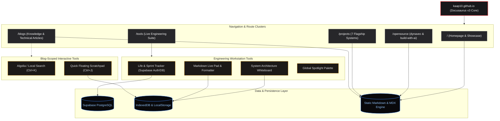

# Vardhman Gupta | Portfolio

> An integrated digital workstation, knowledge wiki, and portfolio built for daily software engineering, system design, and AI explorations.

---

## About Me

I'm **Vardhman Gupta** — an AI & Systems Engineer focused on agentic workflows, distributed platforms, and high-performance developer tooling. This repository serves as my personal workstation, technical documentation wiki, and interactive portfolio showcasing open source packages, fullstack systems, and live engineering utilities.

- **Live Site:** [kaap10.github.io](https://kaap10.github.io)
- **GitHub:** [@Kaap10](https://github.com/Kaap10)
- **LinkedIn:** [vardhman-gupta](https://linkedin.com/in/vardhman-gupta)
- **Contact:** [vardhmangupta108@gmail.com](mailto:vardhmangupta108@gmail.com)

---

## Architecture

---

## Features

- **Personal Knowledge Wiki & Blogs**: In-depth articles covering AI orchestration, distributed backend systems, and frontend performance, equipped with scoped **Instant Search (`Ctrl+K`)** and a **Quick Scratchpad (`Ctrl+J`)**.
- **Open Source Tooling (`/opensource`)**: Dedicated showcase for developer utilities including `dynavec` (dynamic vector DB client) and `build-with-ai` (agent template accelerator).
- **Flagship Project Showcase (`/projects`)**: Interactive project matrix spanning AI platforms, fullstack apps, and autonomous agents (Karya, AuraNow, Code with Buddy, IncidentFlow, Terminal Agent, Agent Bench, Model Router).
- **Living Engineering Workstation (`/tools`)**: Integrated suite featuring a customizable architecture whiteboard, Supabase-backed goal/task tracker, live markdown workspace, and spotlight search.
- **Ultra-Responsive Dark UI**: Performance-optimized design with seamless dark/light modes, keyboard shortcuts, and responsive grid layouts.

---

## Techstack

| Domain | Technologies & Libraries |
| :--- | :--- |
| **Framework & Core** | React 18, Docusaurus 3, Webpack 5, Node.js |
| **Language & Typing** | JavaScript (ESNext), TypeScript, Python, SQL |
| **Styling & UI** | CSS Modules, Custom Design System, Lucide Icons, Mermaid.js |
| **Backend & Database** | Supabase (PostgreSQL, Auth, RLS), REST APIs, IndexedDB |
| **Search & AI** | Algolia DocSearch, Local Search Engine, Vector Embeddings |
| **Deployment & CI/CD** | GitHub Pages, GitHub Actions, Vercel |
